# Meta_Kim 项目说明书

这是一份面向外部读者的产品说明书。它解释 Meta_Kim 是什么、为什么需要它、它如何工作、用户会看到什么、当前支持哪些工具端，以及哪些能力还需要继续用真实证据补齐。

如果只看一句话：

> **Meta_Kim 是 AI 编程的治理层：先澄清目标，再发现能力，再选择责任方，执行后审查与验证，最后把可复用经验沉淀到下一轮。**

---

## 1. Meta_Kim 是什么

Meta_Kim 不是另一个 AI 编程助手，也不是一组零散 prompt。它是一套面向 AI 编程工作的治理系统。

今天的 Claude Code、Codex、OpenClaw、Cursor 等工具已经很会写代码、改文件、跑命令。真正让复杂任务失控的，往往不是“模型不会写”，而是：

- 目标还没澄清，就开始改文件；
- 能力还没发现，就直接指定某个工具或角色；
- 责任边界不清，一个长回复试图包办所有事；
- 命令跑绿就被误认为用户目标已经完成；
- 好经验沉在聊天记录里，下次仍然从零开始。

Meta_Kim 解决的是这些“AI 工作方式”的问题。它把成熟工程团队的工作纪律，变成 AI 编程工具可以执行、可以检查、可以沉淀的流程。

### 1.1 它不是哪些东西

| 常见误解 | 更准确的理解 |
|---|---|
| Meta_Kim 是一个新的代码模型 | 不是。它治理现有 AI 编程工具的工作方式 |
| Meta_Kim 是一堆 agent 名字 | 不是。agent 只是责任单元，核心是能力优先和证据闭环 |
| Meta_Kim 是固定 checklist | 不是。它有固定治理骨架，但会按任务动态生成工作流 |
| Meta_Kim 是越复杂越好 | 不是。简单问题走短路径，复杂问题才展开治理 |
| Meta_Kim 是让 AI 绕过人类确认 | 不是。外部写入、权限、凭证、付费和高风险动作仍需要边界与确认 |

---

## 2. 它解决什么问题

没有治理层时，AI 编程的失败常常发生在“动手之前”和“说完成之后”。

| 痛点 | 没有治理时 | Meta_Kim 的处理方式 |
|---|---|---|
| 目标不清 | AI 猜需求并直接改 | Critical 先锁定真实目标、成功标准、非目标和权限边界 |
| 能力选择随意 | 因为某工具可用就调用 | Fetch 先查 agent、skill、命令、脚本、MCP、插件、运行时工具、记忆、图谱和依赖 |
| 责任混乱 | 一个回复包办规划、执行、审查、验证 | Thinking 明确 owner、weapon、依赖、运行时、OS、审查和验证 owner |
| 复杂任务串行拖慢 | 每个子任务都排队 | 独立工作单可并行，依赖工作单按顺序执行 |
| 质量不可复盘 | 只说“已完成” | Review、Meta-Review、Verification 留下可检查证据 |
| 证据层级混淆 | smoke 被说成 live pass | 区分结构检查、样例验证、真实运行、用户体验和发布级验证 |
| 经验无法复用 | 下次继续从零开始 | Evolution 决定写回 skill、agent、script、contract、memory 或记录不沉淀原因 |

一句话：Meta_Kim 不是让 AI “更快乱冲”，而是让 AI “更像一个可治理的工程团队”。

---

## 3. 适合谁

Meta_Kim 适合：

- 经常用 AI 编程工具处理复杂任务的个人或团队；
- 需要跨文件、跨模块、跨前后端、跨运行时协作的项目；
- 需要过程可复盘、结论可审查、结果可验证的 AI 工程工作；
- 希望同一套工程纪律能在 Claude Code、Codex、OpenClaw、Cursor 中复用的人；
- 希望把有效经验沉淀成长期能力，而不是留在聊天历史里的人。

Meta_Kim 不适合：

- 一次性问答；
- 只改一个很小的函数；
- 不需要审查、不需要证据、不需要长期沉淀的轻量任务；
- 只想让 AI 绕过权限、安全、确认和真实验证边界的工作。

---

## 4. 你会得到什么

对外看，Meta_Kim 提供的是一套 AI 编程治理能力。

| 能力 | 用户价值 |
|---|---|
| 自然语言入口 | 用户不用先学命令词，普通任务会被自动分类 |
| 意图放大 | 模糊需求会被翻译成目标、成功标准、非目标和风险边界 |
| 能力优先分派 | 先找已有能力，再决定 owner 和工具组合 |
| 动态工作流 | 不把所有任务塞进同一张表，而是按任务生成节点和依赖 |
| 多工具端投影 | 同一套核心治理逻辑投影到 Claude Code、Codex、OpenClaw、Cursor |
| 证据分层 | 不把配置存在、命令通过、样例 smoke 和真实运行混成一种“完成” |
| 长期沉淀 | 有价值的经验进入可复用资产；没有沉淀价值时也明确说明 |

---

## 5. 快速开始

如果只是想快速试用：

```bash
npx --yes github:KimYx0207/Meta_Kim meta-kim
```

如果要维护源码：

```bash
git clone https://github.com/KimYx0207/Meta_Kim.git
cd Meta_Kim
npm install
node setup.mjs
```

安装后可以查看当前足迹：

```bash
npm run meta:status
```

想看一次可运行的治理证明：

```bash
npm run meta:theory:demo
npm run meta:run-status:latest
npm run meta:theory:report -- --run-id latest
npm run meta:delivery:bundle
```

这条证明链会展示：模糊目标如何被澄清、能力如何先于执行被发现、工作如何拆成有边界的任务、审查和验证如何留下证据、兼容证据如何分层。

---

## 6. 总体工作流

Meta_Kim 的执行骨架是八个阶段：

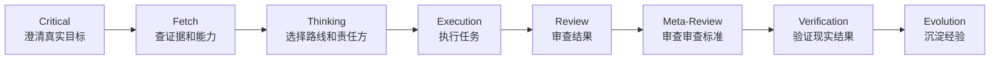

这八个阶段回答八个问题：

| 阶段 | 核心问题 | 典型产物 |
|---|---|---|
| Critical | 用户真正想要什么？什么算成功？什么不要做？ | 意图、成功标准、非目标、边界 |
| Fetch | 当前事实、可用能力、历史证据和约束是什么？ | 证据、能力发现、矛盾记录 |
| Thinking | 哪条路线最合适？谁负责？用什么能力？怎么验证？ | 分派看板、工作单、验证计划 |
| Execution | 按选定路线产出什么结果？ | 文件改动、报告、脚本输出、任务结果 |
| Review | 结果和上游路线是否可靠？ | 审查发现、风险等级、修复要求 |
| Meta-Review | 审查本身是否足够严格、足够对题？ | 审查标准评估 |
| Verification | 新证据是否支持完成声明？ | 命令、日志、截图、产物或人工验收记录 |
| Evolution | 什么经验应该写回？什么不值得沉淀？ | 写回决定、能力缺口、伤疤记录 |

### 6.1 11 阶段业务工作流

八阶段脊柱负责执行逻辑。复杂 run 还会叠加一个业务工作流，用来管理交付闭环：

```text
direction -> planning -> execution -> review -> meta_review -> revision -> verify -> summary -> feedback -> evolve -> mirror
```

它不是替代八阶段，而是在八阶段之上管理“交付物怎么流转、什么时候修订、什么时候总结、什么时候等待反馈、什么时候同步镜像”。

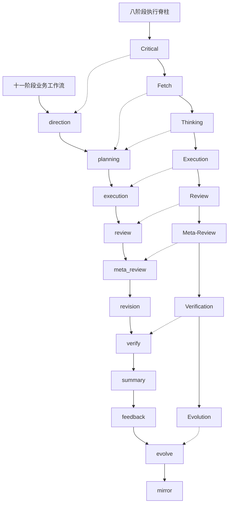

---

## 7. 核心模块

### 7.1 目标澄清模块

目标澄清模块负责防止 AI 从一开始就跑偏。

它会把用户输入拆成：

- 真实目标；
- 成功标准；
- 非目标；
- 风险、权限和外部写入边界；
- 是否需要用户确认。

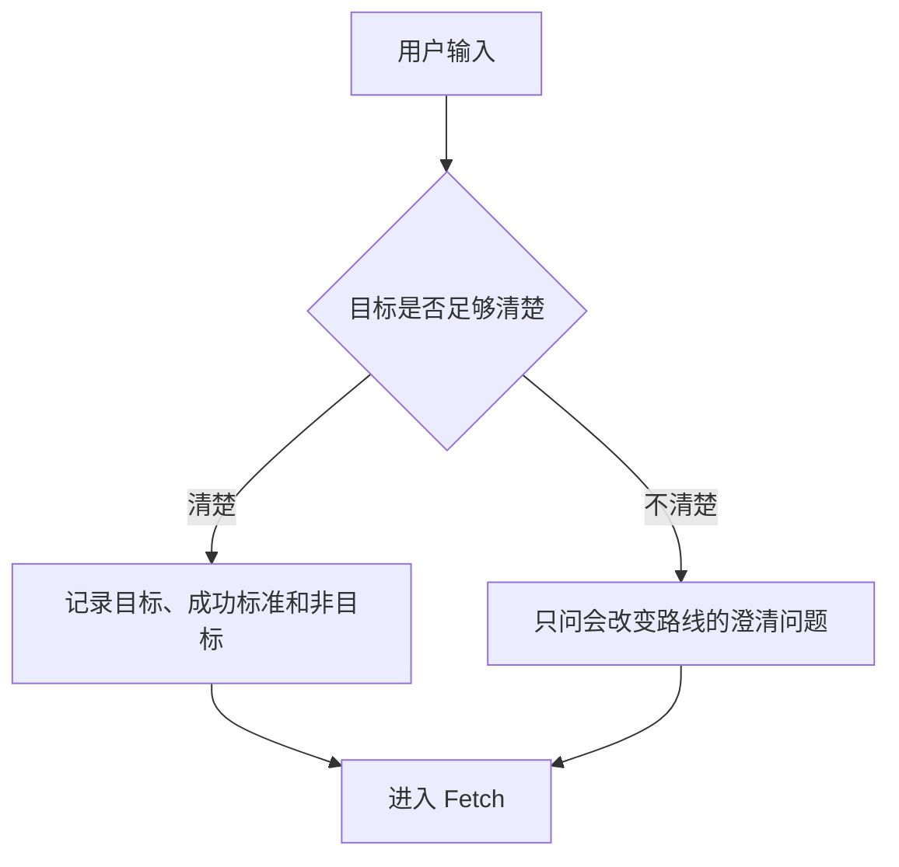

对外价值：复杂任务不再建立在误解上。

### 7.2 全局能力发现模块

能力发现不是“找几个 skill”。Meta_Kim 会先定义任务需要什么能力，再搜索现有 provider。

它会检查：

- canonical agents、skills、runtime assets、contracts；
- 工具端镜像和项目级 runtime 文件；
- 全局 runtime home 中的 agents、skills、commands、hooks、rules；
- package scripts、本地脚本、验证器和安装/同步命令；
- MCP 配置、MCP server、MCP tool；
- 插件、连接器和运行时原生工具；
- memory、Graphify、历史 run 索引；
- dependency project registry 和外部能力候选；
- runtime capability matrix 和 OS compatibility matrix。

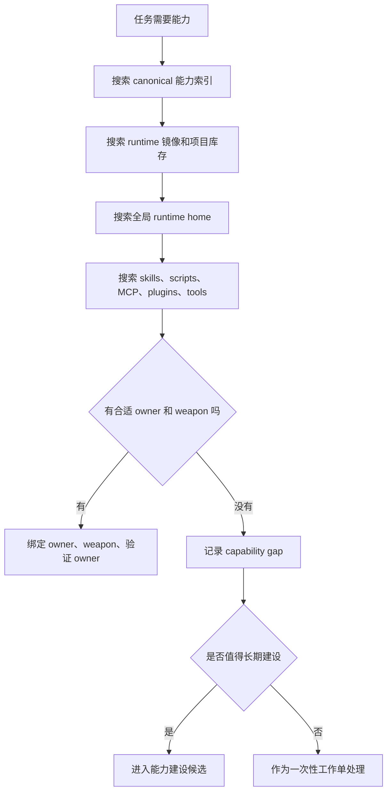

对外价值：减少重复造轮子，避免把所有问题都写成新 agent、新 skill 或新工具。

### 7.3 Dynamic Workflow 模块

Meta_Kim 不把所有任务塞进同一张固定流程表。它会按目标、风险、证据需求、依赖、运行时和可用能力生成任务专属工作流。

| 用户任务 | 可能触发的工作节点 |
|---|---|
| 优化一份对外说明书 | 资料抓取、产品叙事、结构设计、写作、图表兼容、审查、验证 |
| 做复杂产品功能 | 产品判断、UX、前端、后端、数据、安全、测试、发布 |
| 修复运行时问题 | 复现、日志分析、能力发现、修复、回归验证、沉淀 |
| 做外部研究 | 问题拆解、资料检索、反证、综合判断、引用整理 |

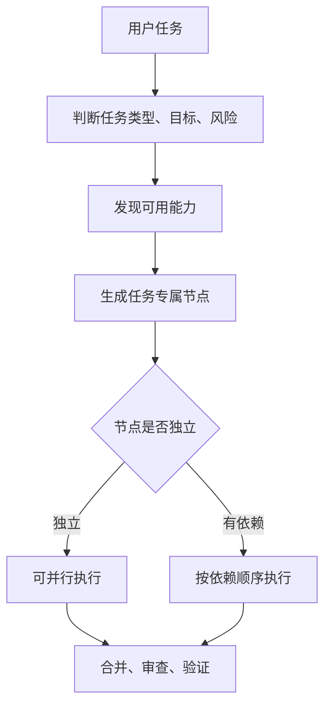

对外价值：简单任务不过度治理，复杂任务不靠一个长回复硬撑。

### 7.4 LangGraph-style 运行图模块

一次复杂 run 可以表示成节点、边、状态和检查点：

- node：阶段或工作单；
- edge：依赖关系和流转方向；
- state：目标、证据、能力选择、风险、审查结论；
- checkpoint：关键阶段的可复盘证据。

这里的 LangGraph-style 是运行结构说明，不表示所有运行时都必须依赖 LangGraph 这个库。

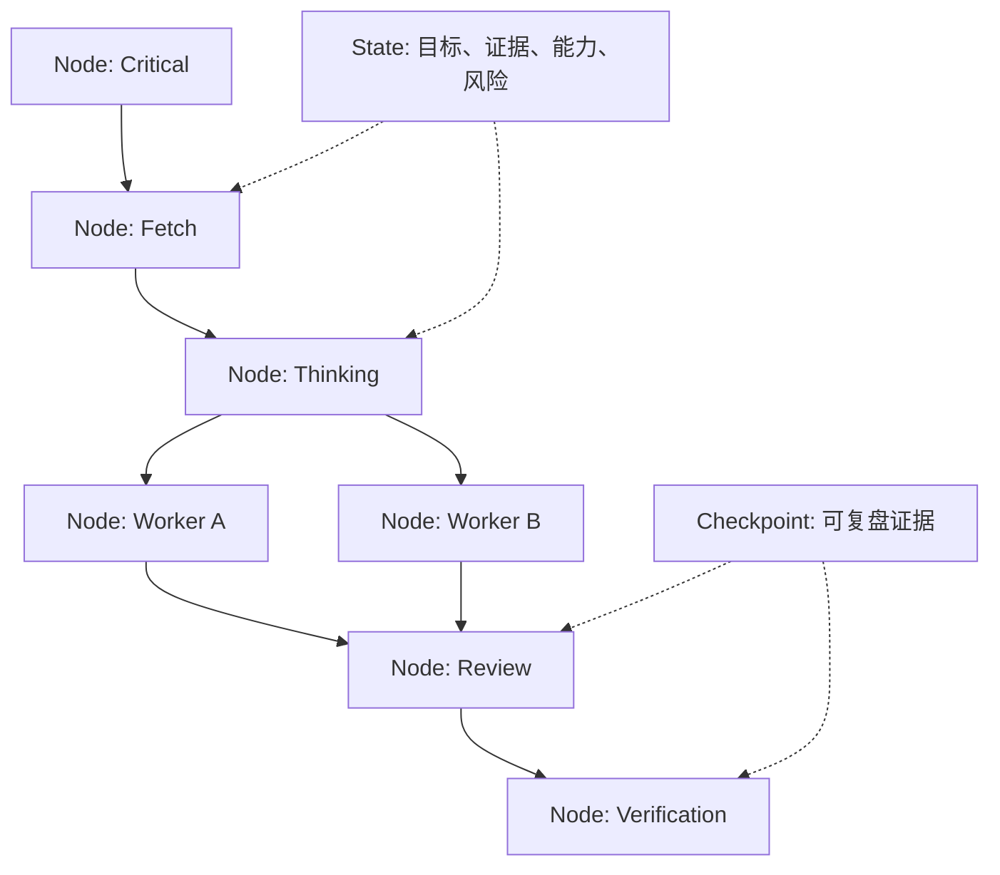

对外价值：复杂任务不是聊天里的一团文本，而是可以追踪、恢复、审查和验证的运行图。

### 7.5 任务编排模块

任务编排模块把复杂任务拆成可执行、可审查、可合并的工作单。

它会明确：

- 哪些任务可以并行；
- 哪些任务必须串行；
- 谁负责执行；
- 谁负责合并；
- 谁负责审查；
- 谁负责验证；
- 哪些外部写入或高风险动作需要确认。

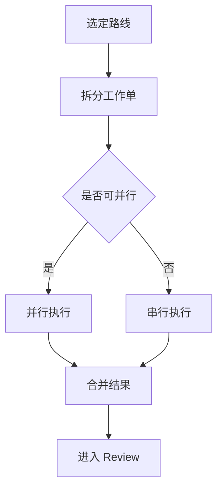

对外价值：复杂任务有清晰分工和合并路径，不再靠单个回复“全能表演”。

### 7.6 质量审查模块

质量审查模块不只看结果，也看上游过程：

- 目标是否锁定；
- Fetch 证据是否改变或支撑路线；
- Thinking 是否选对 owner、weapon、依赖、运行时、OS 和验证 owner；
- 执行是否越界；
- 是否删除或降级了原生能力；
- 是否把部分完成说成全部完成。

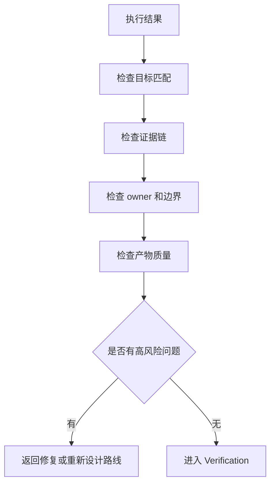

对外价值：减少“看起来做了，但其实没做对”的情况。

### 7.7 验证模块

验证模块把“我觉得完成了”变成“有证据支持”。

Meta_Kim 会区分不同证据层级：

| 证据层级 | 含义 | 能否宣称 live pass |
|---|---|---|
| 结构检查 | 文件、配置、schema、投影关系成立 | 不能 |
| 样例 smoke | 固定样例或非真实 evaluator 跑通 | 不能 |
| 运行时警告或系统消息 | 看到了 UI/系统提示，但没有真实目标运行产物 | 不能 |
| skipped / needsAuth | 权限、模型、配置或环境阻塞 | 不能 |
| runtime live pass | 目标工具端真实调用，并有可恢复产物和评分/验证 | 可以 |
| release-grade evidence | 安装、更新、同步、依赖、安全和多运行时证据链闭合 | 可以支持发布级声明 |

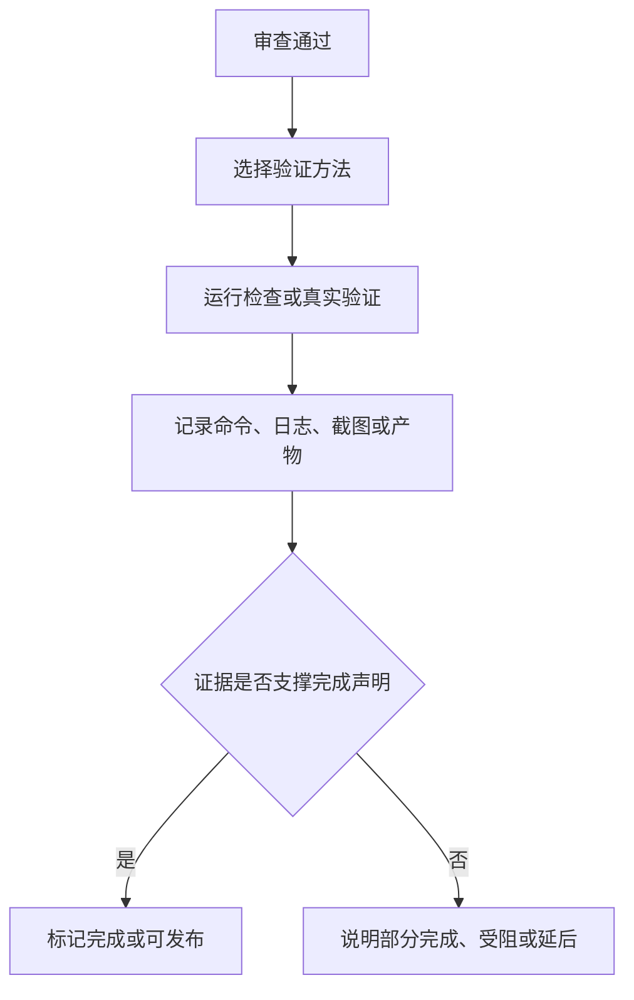

对外价值：用户能看清“现在到底证明到了哪一层”。

### 7.8 经验沉淀模块

经验沉淀模块负责判断这次 run 的经验是否值得写回。

可能沉淀为：

- 可复用流程；
- 长期责任角色；
- 稳定脚本或命令；
- contract、validator、rule；
- memory 或 Graphify 线索；
- 失败伤疤和下次预防规则；
- capability gap。

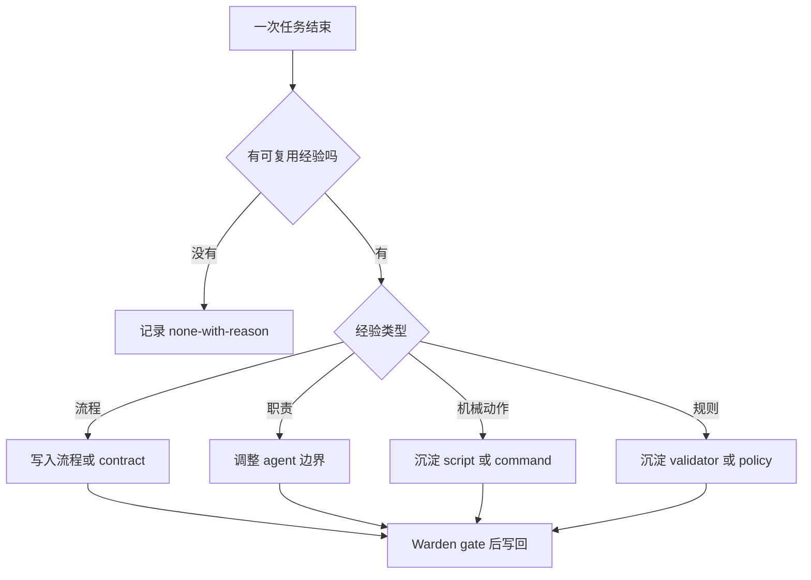

对外价值：Meta_Kim 会随着真实使用越来越熟，而不是每次重新开始。

---

## 8. 多工具端适配

Meta_Kim 的长期行为来自 canonical 主源，再投影到不同工具端。这样可以避免每个平台维护一套互相漂移的规则。

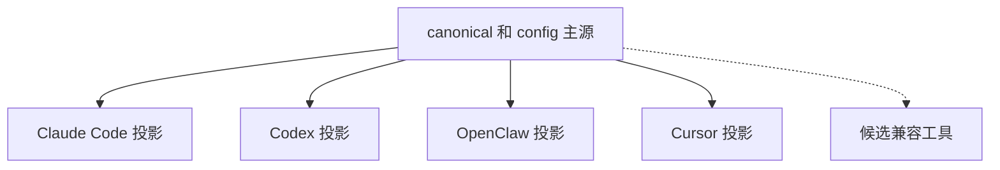

| 层级 | 产品 | 含义 |
|---|---|---|
| 默认正式投影 | Claude Code、Codex | 默认同步并校验，是当前主链路 |
| 非默认但正式投影 | OpenClaw、Cursor | 显式选择目标时生成；runtime 改动需要工具端自测证据 |
| 候选兼容 probe | Qoder CLI、Trae、Kiro、Windsurf / Devin Desktop Cascade、Cline、Roo Code、Continue | 记录兼容原始能力，不宣称正式支持 |

正式支持不等于“配置文件看起来存在”。一个工具端要升级为正式投影，需要补齐 adapter、profile/layout 生成、sync 测试和 live 验证。

---

## 9. 安装范围与主源边界

Meta_Kim 区分三层：

| 层级 | 作用 |
|---|---|
| 全局可复用能力 | 安装到各 runtime 的用户目录，跨项目复用 |
| 项目投影 | 在具体项目中写入上下文、配置、状态和必要的专用覆盖层 |
| 本地状态 | 缓存、运行记录、能力库存、备份和本机配置 |

默认安装路径优先建立全局可复用能力。项目内文件只在需要项目专用上下文、bootstrap 或覆盖层时写入，并且要保留已有用户配置。

维护者应该优先修改这些主源：

- `canonical/agents/`
- `canonical/skills/meta-theory/`
- `canonical/runtime-assets/`
- `config/contracts/`
- `config/capability-index/`

然后运行：

```bash
npm run meta:sync
npm run meta:validate
```

运行时目录如 `.claude/`、`.codex/`、`.cursor/`、`openclaw/` 通常是投影结果，不是长期行为主源。

---

## 10. 三层记忆体系

Meta_Kim 的记忆不是一份大杂烩笔记，而是分三层协作。

| 层 | 负责什么 | 用户价值 |
|---|---|---|
| Memory | 记录长期经验、运行结论、可复用线索 | 跨会话连续性 |
| Graphify | 把项目结构变成知识图谱 | 降低幻觉，减少全文读取 |
| SQL / 向量检索 | 索引运行产物和历史证据 | 从历史 run 中精确召回上下文 |

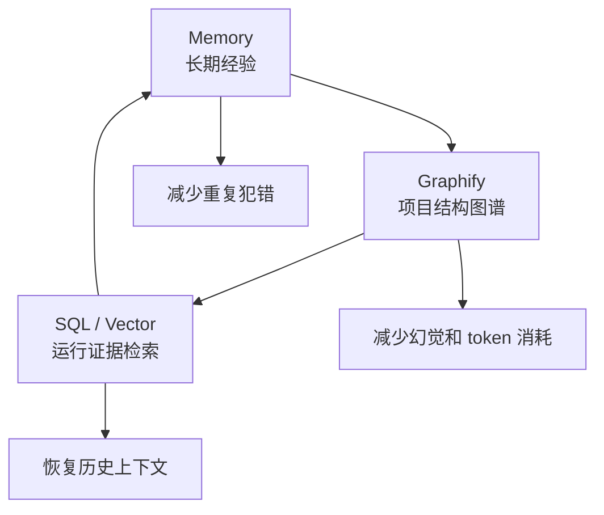

对外理解可以很简单：Memory 记住经验，Graphify 读懂结构，SQL 帮你找回过去的证据。

---

## 11. 用户实际会看到什么

理想体验不是让用户读协议字段，而是让用户直接用自然语言工作。

1. 用户直接说任务。
2. 系统判断这是简单问答、普通执行、主观模糊任务，还是受监管任务。
3. 目标不清时，只问会改变路线的关键问题。
4. 系统说明当前路线、能力选择和完成标准。
5. 执行后给出审查与验证结果。
6. 明确说明状态：完成、部分完成、受阻、延后。
7. 如果有可复用经验，说明写回到哪里；如果没有，也说明原因。

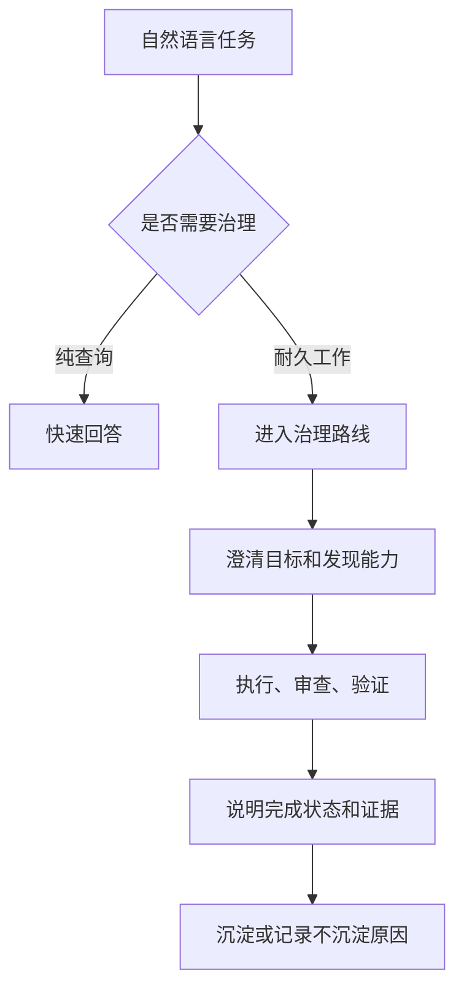

---

## 12. 与普通 AI 编程助手的区别

| 普通 AI 编程助手 | Meta_Kim |
|---|---|
| 按提示直接执行 | 先确认目标、成功标准和非目标 |
| 工具选择常常隐式发生 | 能力选择有证据、有 owner、有边界 |
| 一个回复包办全部 | 任务可拆分、可合并、可审查 |
| 命令通过就容易说完成 | 完成声明必须对应证据层级 |
| 经验留在聊天里 | 可复用经验进入长期能力体系 |
| 不同工具端各自割裂 | 用统一治理层适配多个 AI 编程工具 |
| 遇到失败反复重试 | 同类失败会回到目标、证据或路线设计层面修正 |

---

## 13. 当前边界

对外介绍 Meta_Kim 时，需要诚实说明这些边界：

- 它更适合复杂任务，不适合每个小修改都重走完整治理；
- 它不能替代用户对外部写入、凭证、付费操作和高风险动作的授权；
- 它不会把“配置存在”当作“真实可用”；
- 它不会把基础检查或 smoke 当作发布级证据；
- Cursor、OpenClaw 和候选工具需要按证据层级理解，不应被过度宣传；
- live pass 必须来自真实目标工具端调用，而不是结构校验或系统提示；
- 真实任务样本、演示材料和跨工具端证据仍需要持续补齐。

---

## 14. 当前状态与后续方向

| 方向 | 当前状态 | 后续补齐方式 |
|---|---|---|
| 主链路治理 | Claude Code 和 Codex 是当前主链路 | 用更多真实复杂任务补齐端到端样本 |
| OpenClaw / Cursor | 有正式投影方向，但能力边界不同 | 逐平台补真实运行证据，不把配置等同于可用 |
| 候选工具 | 已记录 compatible primitives | 完成 adapter、sync、测试和 live 证据后再升级 |
| 产品演示 | README 和样例已有基础证明 | 补截图、演示案例、可视化报告 |
| 发布级验证 | 有 routine smoke 和 release-grade 边界 | 安装、更新、同步、依赖、安全相关改动走更完整证据链 |
| 长期记忆 | Memory、Graphify、run index 已形成协作模型 | 增加更多失败恢复、跨模块协作和多轮审查样本 |

---

## 15. 对外展示摘要

Meta_Kim 是 AI 编程的治理层。它的价值不是“更多 AI 角色”，而是“更可靠的 AI 工作方式”。

它让复杂任务先被理解，再被规划，再由合适能力执行，并经过审查、验证和经验沉淀。它把 Claude Code、Codex、OpenClaw、Cursor 等工具从“会动手的模型”变成“可以被治理的工程协作系统”。

最适合对外使用的表达是：

> **Meta_Kim turns chaotic AI coding into governed execution.**
